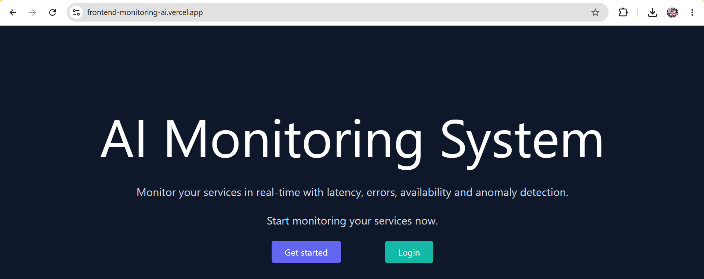
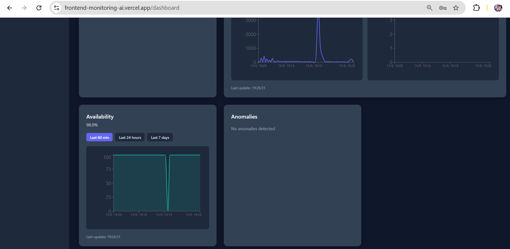
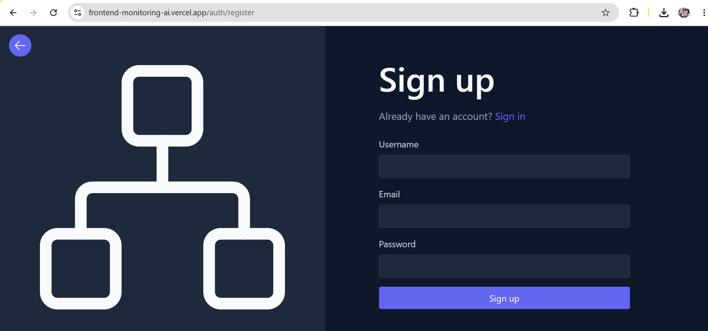
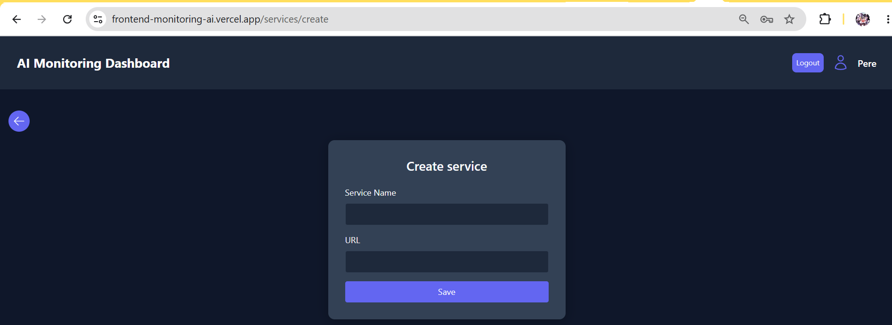
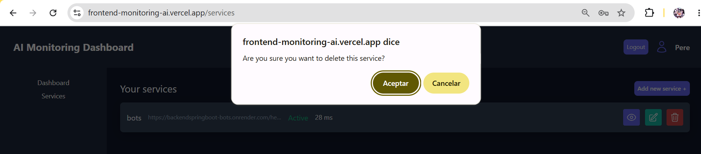
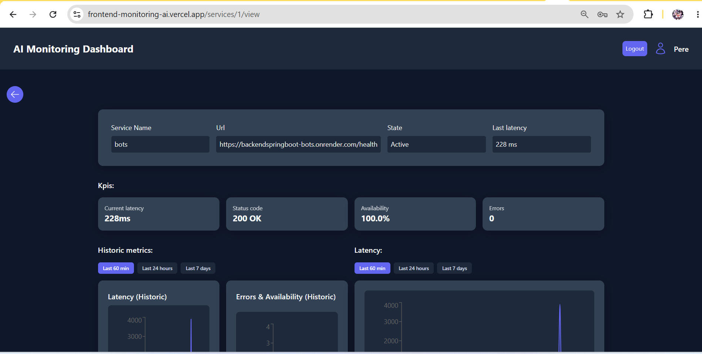
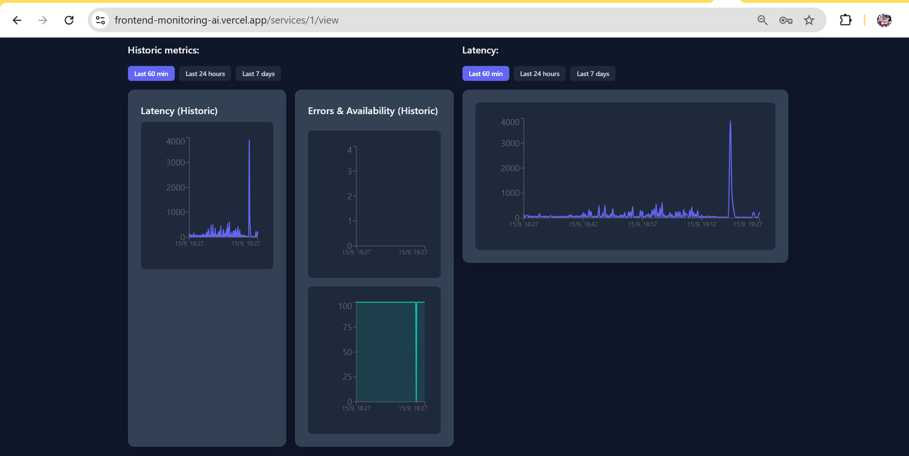
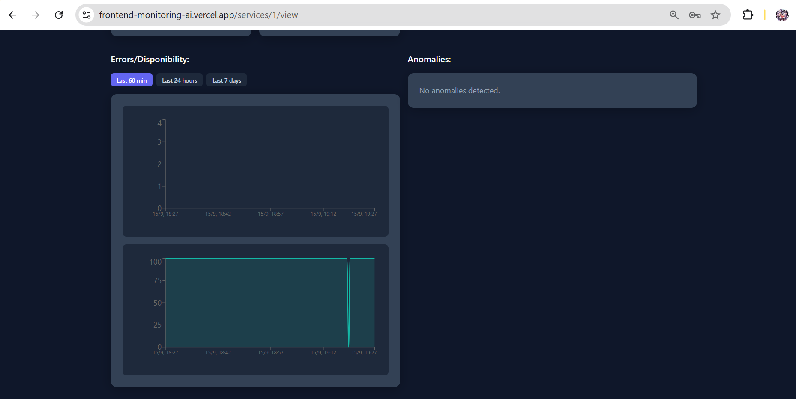

# [English](README.md) | [Español](README.ES.md)

---

<div align="center">

# 🖥️ AI System Monitoring Dashboard

**Real-time infrastructure monitoring for distributed AI services**

[](https://spring.io/projects/spring-boot)
[](https://openjdk.org/projects/25/)
[](https://nextjs.org)
[](https://react.dev)
[](https://www.postgresql.org)
[](https://www.typescriptlang.org)
[](#)
[](#)


</div>

### 🖼️ Screenshots



### Dashboard




### Auth




### Services









---

## 📖 Table of Contents

- [About](#-about)
- [For Whom](#-for-whom)
- [Key Features](#-key-features)
- [Architecture](#-architecture)
- [Tech Stack](#-tech-stack)
- [Getting Started](#-getting-started)
  - [Prerequisites](#prerequisites)
  - [Clone the Repos](#clone-the-repos)
  - [Backend Setup](#backend-setup)
  - [Frontend Setup](#frontend-setup)
  - [Docker Setup](#docker-setup)
- [Usage](#-usage)
- [Environment Variables](#-environment-variables)
- [API Endpoints](#-api-endpoints)
- [Security](#-security)
- [Project Structure](#-project-structure)
- [Roadmap](#-roadmap)
- [Contributing](#-contributing)
- [License](#-license)

---

## 📌 About

**AI System Monitoring Dashboard** is a full-stack monitoring platform designed to track, visualize, and alert on the health of HTTP services in real time. It solves the critical problem of **monitoring deployed services** (APIs, web apps, microservices) that need 24/7 uptime.

The dashboard provides real-time latency, error rates, and availability metrics via Server-Sent Events (SSE), historical charts with flexible time range selection, and multi-user authentication — all essential for teams running production infrastructure at scale.

**Live Deployment:**
- 🌐 [Frontend](https://frontend-monitoring-ai.vercel.app) — Vercel
- ⚙️ [Backend API](https://monitoring-api-txfu.onrender.com) — Render

---

## 👥 For Whom

Backend teams, DevOps engineers, SREs, and students needing lightweight real-time HTTP service monitoring.

---

## ✨ Key Features

| Feature | Description |
|---|---|
| 📊 Real-time dashboard | Live metrics via SSE: latency, errors, uptime % |
| 🔐 Multi-user auth | Register/login with JWT (httpOnly cookies) + Argon2 |
| 🛡️ Security first | Rate limiting (60 req/min/IP), SSRF protection, security headers, CSP |
| 📈 Historical charts | Recharts: latency line, errors bar, availability area |
| ⏱️ Range selector | Last 60 min / Last 24 hours / Last 7 days |
| 🔔 Anomaly detection | Backend detects latency spikes, error spikes, downtime |
| 📱 Fully responsive | Mobile-first design with hamburger sidebar |
| ⚡ SSE streaming | Real-time push updates without polling |
| 🗃️ Pagination | Services page: 3 items/page with custom pagination |
| 🧪 Test suite | 47+ unit tests with JUnit 5 + Mockito |

---

## 🏗️ Architecture

```
Next.js (Vercel) → Spring Boot (Render) → PostgreSQL (Supabase)
```

**Flow:** Login → JWT cookie → REST API → Scheduler polls services every 30s → Metrics stored → SSE streams to dashboard → Charts + anomaly detection

---

## 🛠️ Tech Stack

| Layer | Stack |
|---|---|
| Backend | Java 25, Spring Boot 4.1, JPA, PostgreSQL (Supabase), Spring Security, JJWT, Argon2 |
| Frontend | Next.js 16, React 19, TypeScript 5, Tailwind CSS 4, Recharts 3 |
| Testing | JUnit 5 + Mockito (47+ tests) |
| Deploy | Render (backend) + Vercel (frontend) |

---

## 🚀 Getting Started

**Prerequisites:** Java 25+, Node.js 20+, PostgreSQL (or Supabase)

```bash
# Clone repos
git clone https://github.com/Dage10/BackendMonitoringAi.git
git clone https://github.com/Dage10/FrontendMonitoringAi.git

# Backend
cd BackendMonitoringAi/monitoring-api/monitoring-api
./gradlew bootRun  # http://localhost:8080

# Frontend
cd FrontendAiMonitoring/ai-monitoring-dashboard
npm install && npm run dev  # http://localhost:3000
```

> Docker: `docker compose up --build` (backend only)

---

## 💡 Usage

1. **Register** a new account at `/auth/register`
2. **Login** with your credentials
3. **Add services** to monitor (provide a name and health check URL)
4. **View dashboard** — real-time charts update via SSE every 30 seconds
5. **Switch time ranges** — Last 60 min / Last 24 hours / Last 7 days
6. **Check anomalies** — backend flags latency spikes and error rate increases

---

## 🔧 Environment Variables

### Backend

| Variable | Description | Default |
|---|---|---|
| `DB_URL` | PostgreSQL connection URL | `jdbc:postgresql://localhost:5432/monitoring` |
| `DB_USER` | Database username | `postgres` |
| `DB_PASSWORD` | Database password | — |
| `JWT_SECRET` | Secret key for JWT signing | — |
| `SPRING_PROFILES_ACTIVE` | Active Spring profile | `local` |
| `CORS_ORIGINS` | Comma-separated allowed origins | `http://localhost:3000` |

### Frontend

| Variable | Description | Default |
|---|---|---|
| `NEXT_PUBLIC_API_URL` | API base URL (for SSR/client) | `/api` |
| `API_PROXY_URL` | Backend URL for Next.js API proxy | `http://localhost:8080` |

---

## 📡 API Endpoints

| Endpoint | Method | Description |
|---|---|---|
| `/api/auth/{register,login,me}` | POST/GET | Authentication (JWT cookies) |
| `/api/services[/{id}]` | GET/POST/PUT/DELETE | Services CRUD |
| `/api/services/{id}/metrics` | GET | Paginated metrics |
| `/api/metrics/stream` | GET | SSE real-time stream |
| `/api/metrics/anomalies` | GET | Detected anomalies |
| `/actuator/health` | GET | Health check |

---

## 🔒 Security

Argon2 passwords · JWT httpOnly cookies · Rate limiting (60/min/IP) · SSRF protection · CSP + security headers · CORS restricted · Audit logging

---

## 📁 Project Structure

```
Backend:  auth/ config/ metrics/ services/ users/
Frontend: app/(protected)/ components/ lib/
```

- **Backend**: REST API, JWT auth, SSE streaming, anomaly detection, rate limiting
- **Frontend**: Dashboard with Recharts, services CRUD, responsive sidebar

---

## 🗺️ Roadmap

- [ ] Email/webhook alerts
- [ ] Custom check intervals
- [ ] Service groups & tags
- [ ] User roles (admin/viewer)
- [ ] Dark/light theme
- [ ] CSV export
- [ ] Kubernetes/Docker integration

---

## 🤝 Contributing

Fork → branch → commit with [Conventional Commits](https://www.conventionalcommits.org/) → PR. Ensure `./gradlew test` and `npm run lint` pass.

---

## 📝 License

This project is licensed under the MIT License — see [LICENSE](../LICENSE) for details.

---

<div align="center">

**Built with ❤️ using Spring Boot, Next.js, and modern 2026 best practices**

</div>
